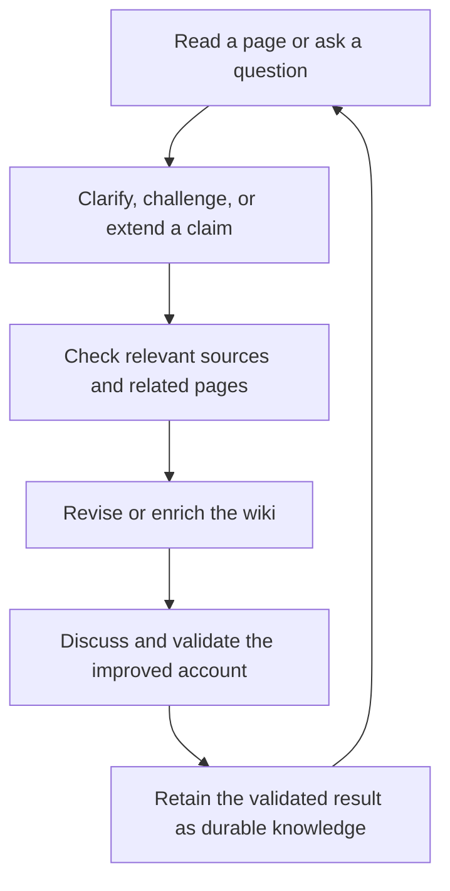
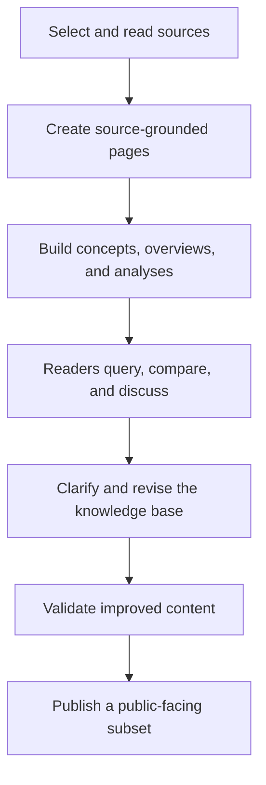

## Summary
WoLaLa Wiki is a research wiki about language models and language. It is designed as a curated knowledge space for reading, questioning, comparing, and refining ideas about what language models can do, what they cannot do, how they should be studied, and how they connect to linguistics, philosophy of language, cognitive science, and related fields.

The wiki is meant to be useful in two ways at once. It is a place to find durable, source-grounded summaries of important literatures. It is also a place where knowledge can be actively improved through questions, discussion, clarification, revision, and the careful incorporation of new understanding.

## What WoLaLa Wiki Is About
The central focus of WoLaLa Wiki is the relation between language models and language.

That includes questions such as:
- what kinds of linguistic structure are present in model representations
- what evidence supports claims about competence, understanding, or limitation
- how meaning, reference, grounding, and language use should be understood in relation to language models
- how neural mechanisms and circuit-level explanations bear on language-related behavior
- how language models connect to theoretical linguistics, philosophy of language, cognitive science, neuroscience, and broader SSH inquiry

The wiki is therefore not just a catalog of papers about AI. It is a structured attempt to build a cumulative, interpretable body of knowledge around a specific intellectual agenda.

## How the Wiki Is Organized
The wiki uses a few main page types, each with a different role.

### Source Pages
Source pages are the anchor points of the wiki. Each source page summarizes one paper, book chapter, or closely related source bundle in a durable, source-grounded way.

They are where the wiki records:
- what a source argues
- what evidence it presents
- what distinctions or cautions it introduces
- how it connects to other pages

If a reader wants to know where a claim in the wiki comes from, the source page is usually the best place to start.

### Concept Pages
Concept pages define and stabilize important ideas that recur across multiple sources.

Examples include things like probing classifiers, induction heads, in-context learning, or meaning and reference in language models. A concept page is not just a dictionary definition. It is a compact synthesis of how a term or idea functions across the literature.

Concept pages help keep the wiki coherent as more sources are added.

### Overview Pages
Overview pages map a topic area. They show the shape of a cluster, identify the central questions, summarize major positions, and point readers toward the most important source, concept, and analysis pages.

An overview is often the best starting point for a reader who wants orientation before going deeper.

### Analysis Pages
Analysis pages are question-driven syntheses. They take a reusable question, comparison, or dispute and work through it across multiple sources.

An analysis page does not simply summarize individual papers. It asks what follows when several sources are read together. This is where the wiki becomes most explicitly comparative and interpretive.

### Operational and Planning Pages
Some pages exist to support curation, planning, and maintenance. They help track scope, priorities, and workflow, but they are not the main reader-facing knowledge layer.

For most readers, these pages matter only in the background. The main public-facing experience of the wiki runs through source, concept, overview, and analysis pages.

## How These Page Types Work Together
The page types are meant to reinforce one another.

- Source pages provide the evidence base.
- Concept pages stabilize recurring ideas and terminology.
- Overview pages map a topic and show how the pieces fit together.
- Analysis pages test interpretations, resolve tensions, and compare positions across sources.

Together, they form a layered structure:
- source pages keep the wiki grounded
- concept pages keep it coherent
- overview pages keep it navigable
- analysis pages keep it intellectually active

This means the wiki can be read in more than one way. A reader can move from a big-picture overview into specific sources, from a source into a concept page, or from a concept into an analysis that tests how the idea behaves across a wider literature.

## How Knowledge Grows Here
WoLaLa Wiki is not meant to be a static archive of finished summaries. It is meant to support an ongoing cycle of reading, questioning, synthesis, revision, and validation.

New knowledge may arise with a reader question. A question may expose an ambiguity, a missing distinction, an overstatement, or a useful comparison that the current pages do not yet make clearly enough. That question can lead to a local clarification, a stronger source-grounded formulation, a new analysis, or a broader reorganization of a topic.

Some of that development happens through direct discussion around existing pages. Some of it happens by tracing claims back to sources and revising the wiki in place. Over time, valuable questions and answers can become part of the durable knowledge base, provided they are checked carefully and integrated in a way that remains readable and source-grounded.

### Knowledge-Enrichment Cycle

The important point is that querying the wiki is part of how the wiki improves. Questions are not only requests for information. They may also help reveal where the current structure is strong, where it is thin, and where a more precise understanding should be added.

## The Main Workflow at a High Level
The wiki grows through a fairly simple high-level pattern.

First, sources are selected and read. Their main claims, evidence, distinctions, and limitations are turned into source pages. From there, repeated ideas are stabilized in concept pages, topic clusters are mapped in overview pages, and cross-source questions are worked out in analysis pages.

Readers may query the wiki in different ways. They may ask what a claim means, whether the wiki is drawing the right distinction, how two sources relate, or whether a stronger or weaker formulation would be more accurate. Those questions can trigger local revision, new synthesis, or the recognition that a topic needs a new concept or analysis page.

When new understanding emerges through this process, it should not remain only in conversation. It becomes most valuable when it is checked, validated, and fed back into the wiki itself as improved content. From there, a public subset can be exported and published for broader use.

### From Ingestion to Public Publication

## How to Use the Wiki
There is no single right path through the wiki, but a few reading patterns work well.

- If you want orientation, start with an overview page.
- If you want to verify a claim, open the linked source page.
- If you want to understand a recurring idea, move from the overview or source page into the relevant concept page.
- If you want to understand a dispute, a threshold question, or a comparison across papers, open the relevant analysis page.

Readers can also use the wiki in the reverse direction. A specific question can serve as the entry point, and the wiki can then be used to trace that question outward into concepts, sources, and neighboring debates.

## How Readers and Contributors Can Improve It
WoLaLa Wiki is meant to be jointly improvable.

Useful contributions do not only mean adding more content. They also include:
- asking sharper questions
- noticing when a formulation is too strong or too vague
- identifying a missing distinction
- proposing a better cross-link between pages
- checking whether an interpretation is truly supported by the sources
- helping turn good local discussion into durable, reusable knowledge

The best contributions make the wiki easier to read, easier to trust, and easier to think with.

## Suggested Entry Points
- [[wiki/overviews/Meaning, Reference, and Distributional Language Overview|Meaning, Reference, and Distributional Language Overview]]
- [[wiki/overviews/Neural NLP Probing Overview|Neural NLP Probing Overview]]
- [[wiki/overviews/Induction Heads and In-Context Learning Overview|Induction Heads and In-Context Learning Overview]]
- [[wiki/index|WoLaLa Wiki Index]]

## Related Pages
- [[wiki/index|WoLaLa Wiki Index]]
- [[wiki/overviews/Current Scope|Current Scope]]
- [[wiki/overviews/Meaning, Reference, and Distributional Language Overview|Meaning, Reference, and Distributional Language Overview]]
- [[wiki/overviews/Neural NLP Probing Overview|Neural NLP Probing Overview]]
- [[wiki/overviews/Induction Heads and In-Context Learning Overview|Induction Heads and In-Context Learning Overview]]
